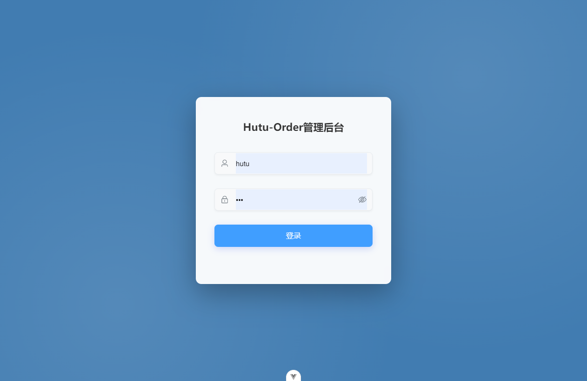
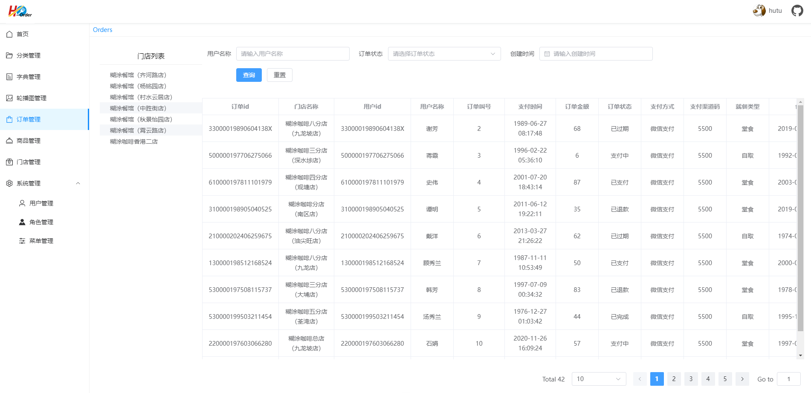

# hutu-order-admin-web
糊涂点餐管理端

## 介绍

基于糊涂点餐业务的管理端，完成基于角色的RABC权限管理，各项业务的增删改查管理功能。

##  运行

0. 导入数据库[ hutu-order/db/hutu-order.sql]
1. 导入nginx配置 [ hutu-order/nginx ]
2. 运行HutuOrder项目 app-AdminApplication.java
3. npm i
4. npm run dev

## 项目介绍

|依赖 |版本|
|--|-- |
|vite |^7.2.4 |
|vue |^3.5.25 |
|element-plus |^2.12.0 |

## 项目截图

